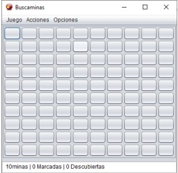

## Buscaminas con Java

En este proyecto implementaremos un programa Buscaminas totalmente funcional y que trabaje según
lo que hemos descrito en este documento hasta ahora, teniendo en cuenta algunos detalles extra que le
agregaremos al juego.

    

        
    

    

        
Se muestran además en la ventana los menús Juego, Acciones y Opciones.
            Debajo del tablero, en la barra de estado, se muestra el número de minas en el tablero, al número de celdas marcadas (representadas por una bandera roja) y el número de celdas que han sido descubiertas hasta el momento..
            El jugador podrá hacer clic en cualquier celda del tablero. Las acciones disponibles que el jugador puede usar son las siguientes:
            ➢ Despejar una celda: haciendo clic con el botón izquierdo sobre una celda oculta sin marcar, el jugadorla despejará. Si la celda tiene mina perderá, y si no, dependiendo del caso, verá un número o despejará una gran parte del tablero (ver las dos imágenes que siguen). En la imagen de la izquierda se ha despejado una celda con una mina alrededor y por tanto se ve el 1; en la imagen de la derecha se ha despejado una celda sin minas a su alrededor y por tanto se despejaron todas sus celdas circundantes aplicando el mismo criterio usado para despejar cualquier celda,generando una reacción en cadena de despejes.

    

